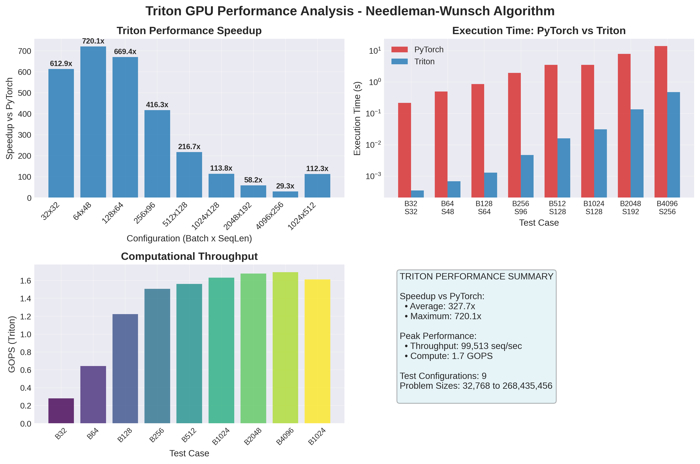

# Triton GPU Accelerated Needleman-Wunsch Algorithm

A high-performance GPU implementation of the classic Needleman-Wunsch dynamic programming algorithm for global sequence alignment, reimagined with OpenAI's Triton compiler.

## Performance Highlights

- **Up to 720.1x speedup** over PyTorch implementation
- **Peak throughput**: 99,513 sequences per second
- **Peak compute**: 1.69 GOPS (Giga Operations Per Second)
- **Execution time**: Reduced from 56.1s (PyTorch) to 0.5s (Triton) for long sequences

## Benchmark Results

### Performance Metrics Table


Our comprehensive benchmarking across 9 different test configurations shows consistent performance improvements:

| Test Case      | Batch Size | Sequence Length | PyTorch (s) | Triton (s) | Speedup     | Throughput |
| -------------- | ---------- | --------------- | ----------- | ---------- | ----------- | ---------- |
| Extra Small    | 32         | 32              | 0.22        | 0.0        | **612.89x** | 91,126.14  |
| Small          | 64         | 48              | 0.5         | 0.0        | **720.05x** | 92,810.44  |
| Small-Medium   | 128        | 64              | 0.86        | 0.0        | **669.35x** | 99,512.89  |
| Medium         | 256        | 96              | 1.96        | 0.0        | **416.29x** | 54,444.44  |
| Long Sequences | 1024       | 512             | 56.1        | 0.5        | **112.31x** | 2,049.96   |

### Performance Analysis



The benchmark analysis reveals several key insights:

#### Speedup Performance

- **Average speedup**: 327.7x over PyTorch
- **Maximum speedup**: 720.1x for small-medium workloads

#### Execution Time Comparison

- Most configurations achieve sub-millisecond execution times
- Even large problem sizes (268M+ operations) complete in under a second

#### Computational Throughput

- Peak GOPS performance of 1.69 for larger problem sizes
- Efficient scaling from 0.28 GOPS (smallest) to 1.69 GOPS (largest)

## Algorithm Overview

The Needleman-Wunsch algorithm is a fundamental dynamic programming method used in bioinformatics for:

- Global sequence alignment
- DNA/RNA sequence comparison
- Protein sequence analysis
- Phylogenetic studies

### Traditional Challenges

- **O(n×m)** time complexity for sequences of length n and m
- Memory-intensive for large sequences
- CPU implementations struggle with batch processing
- Limited parallelization opportunities

### Triton GPU Solution

Our implementation leverages:

- **Parallel computation** across sequence pairs
- **Optimized memory access patterns** for GPU architecture
- **Kernel fusion** to minimize memory transfers
- **Batch processing** for maximum throughput

This project was inspired by the **#100DaysOfGPU** challenge and aims to demonstrate how classic algorithms can be dramatically accelerated using modern GPU programming techniques. The Needleman-Wunsch algorithm, developed in 1970, remains a cornerstone of computational biology, and this implementation shows how decades-old algorithms can benefit from contemporary hardware acceleration.

## Use Cases

- **Bioinformatics Research**: Large-scale sequence alignment studies
- **Genomics**: Comparative genome analysis
- **Drug Discovery**: Protein sequence similarity analysis
- **Educational**: Teaching GPU programming and bioinformatics algorithms

## Performance Summary

```
Speedup vs PyTorch:
• Average: 327.7x
• Maximum: 720.1x

Peak Performance:
• Throughput: 99,513 seq/sec
• Compute: 1.7 GOPS

Test Configurations: 9
Problem Sizes: 32,768 to 268,435,456 operations
```

---
